# Examples

Each example is a small notebook you can copy. On an example's page,
hovering works as it does in Pluto, every click swaps in a recorded
result, brushes swap in results recorded for a few boxes, and the
notebook follows the player as text.
Pan and orbit are recorded clips instead.

## Analyses

Worked examples of an interaction feeding an analysis: a brush that
compares a cluster, a heatmap cell that opens the data behind it, a
click mirrored into a second plot.

```@raw html
<div class="masque-gallery">
<a class="masque-gallery-card" data-page="cluster">
  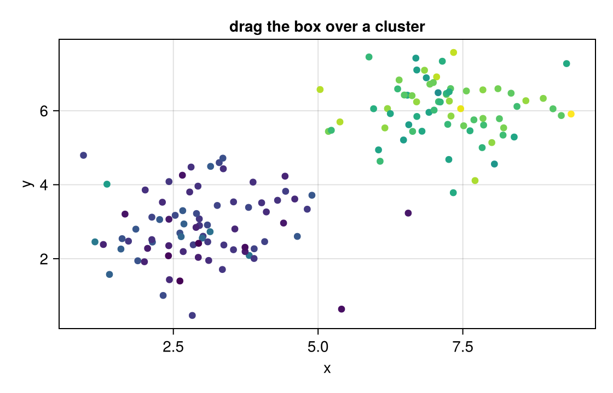
  <span>Compare a cluster</span>
</a>
<a class="masque-gallery-card" data-page="heatmap-trace">
  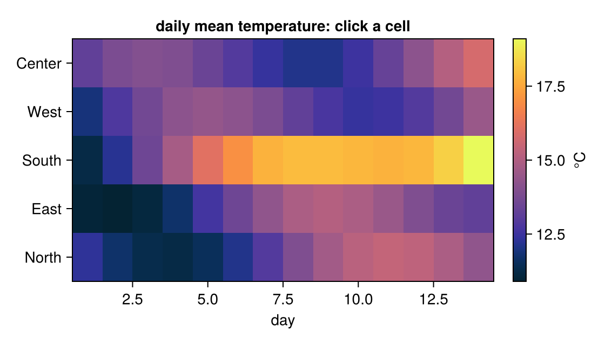
  <span>From a heatmap cell to its trace</span>
</a>
<a class="masque-gallery-card" data-page="selection">
  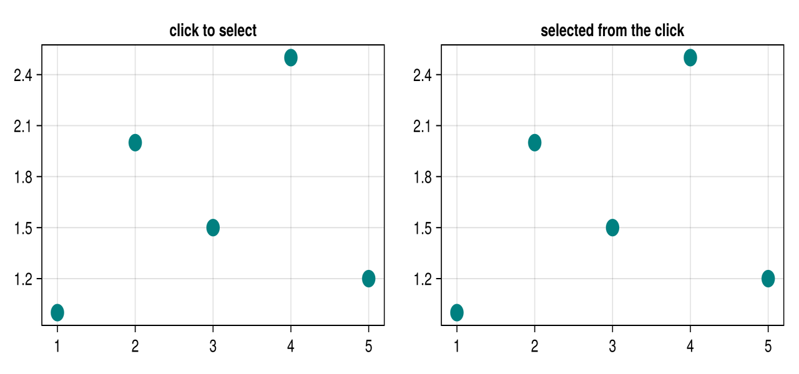
  <span>Selection round-trip</span>
</a>
<a class="masque-gallery-card" data-page="boxselect">
  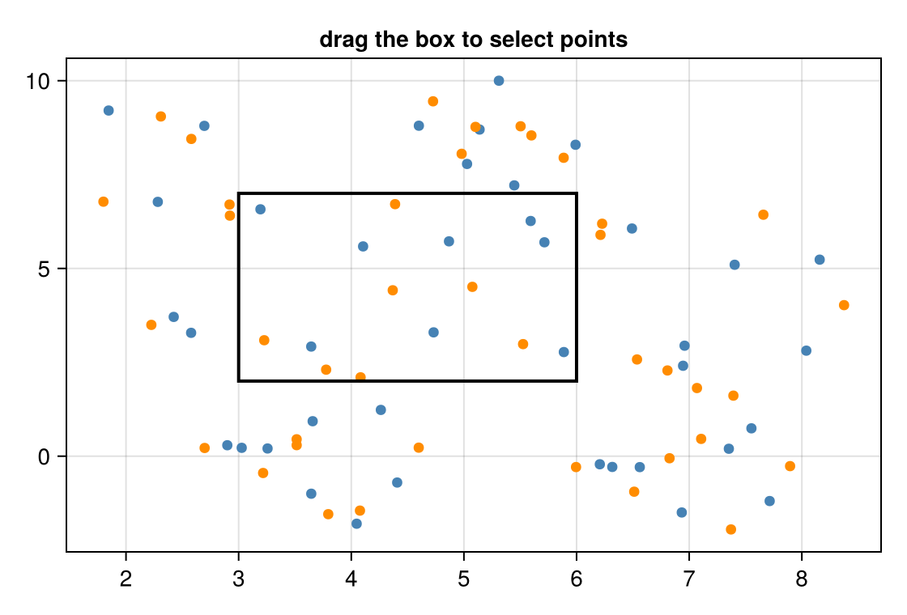
  <span>Box-select scatter</span>
</a>
<a class="masque-gallery-card" data-page="image">
  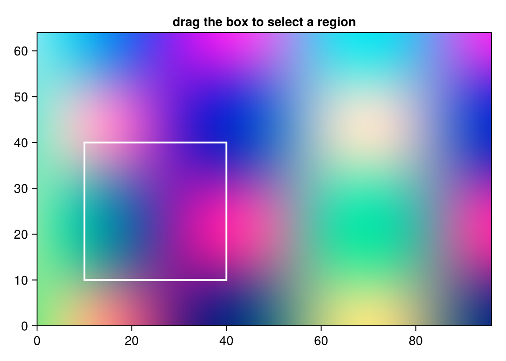
  <span>Image ROI</span>
</a>
<a class="masque-gallery-card" data-page="tooltips">
  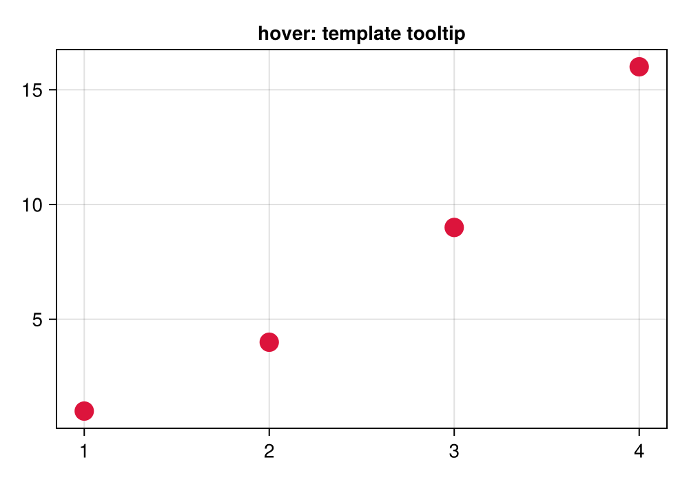
  <span>Tooltip templates</span>
</a>
</div>
```

## Plot types

One page per kind of plot, showing what a hover or click on it returns.
Pan and orbit are recorded clips, since moving the view needs a running
notebook.

```@raw html
<div class="masque-gallery">
<a class="masque-gallery-card" data-page="bars">
  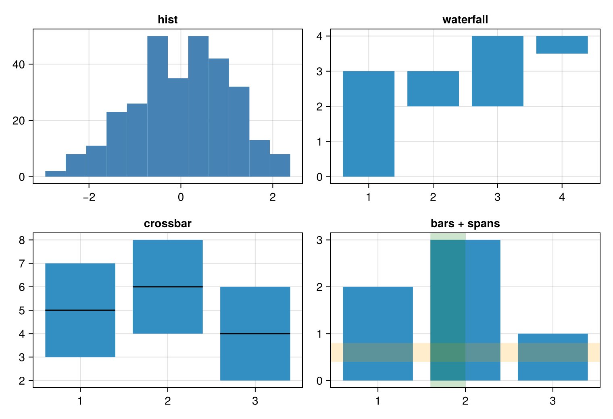
  <span>Bars and areas</span>
</a>
<a class="masque-gallery-card" data-page="polygons">
  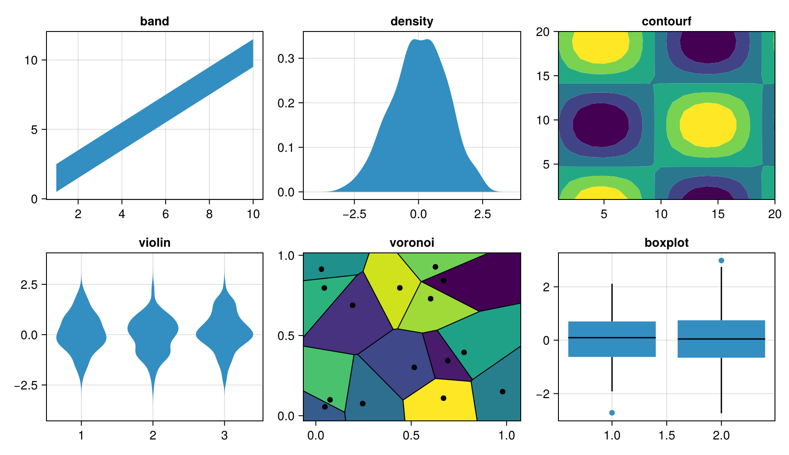
  <span>Polygons</span>
</a>
<a class="masque-gallery-card" data-page="colorbar">
  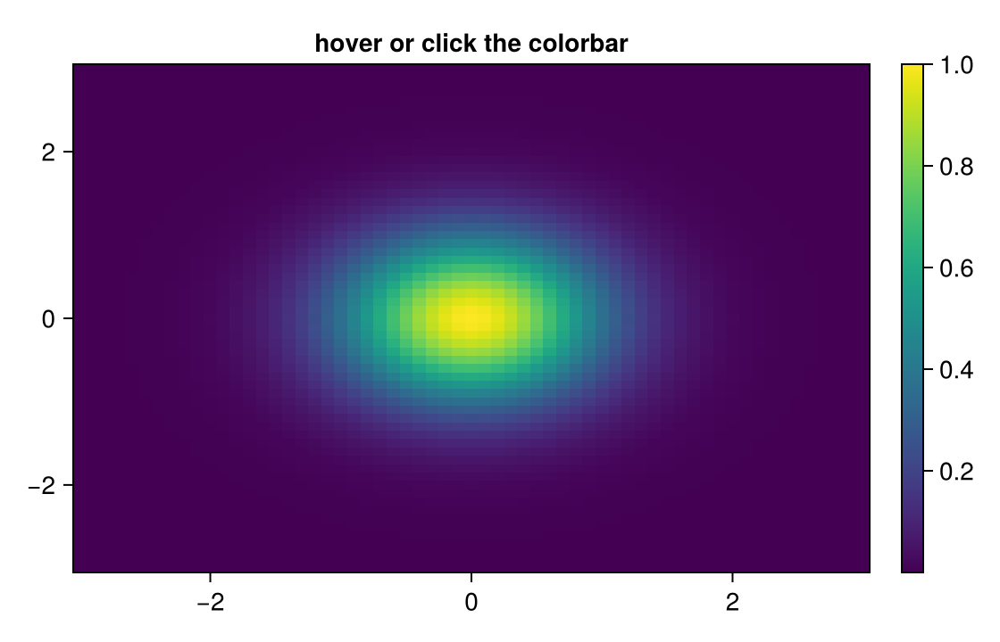
  <span>Colorbar</span>
</a>
<a class="masque-gallery-card" data-page="text">
  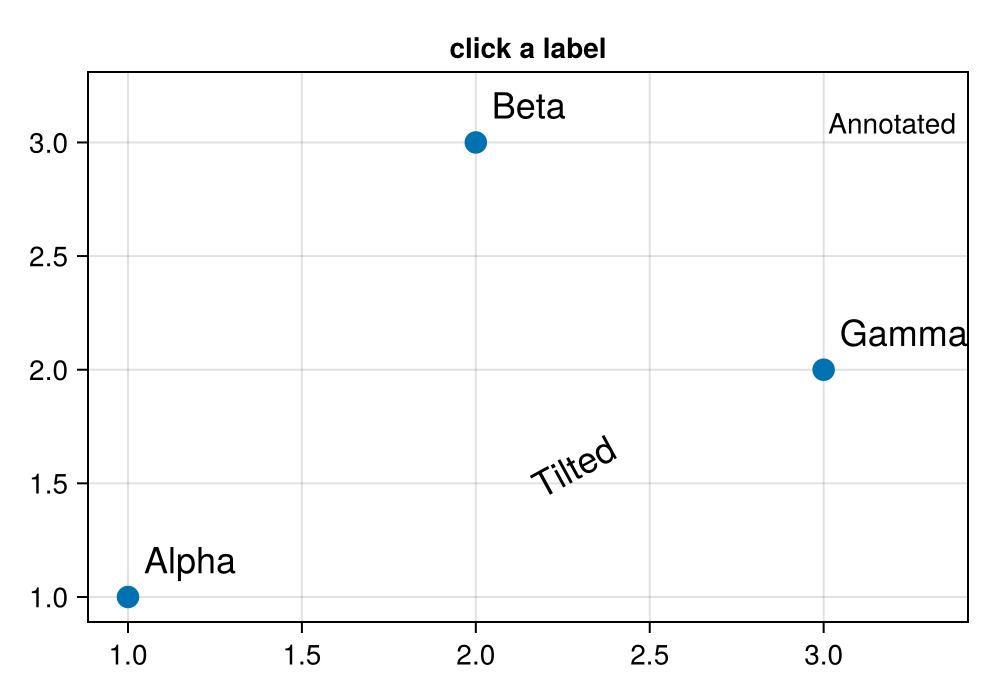
  <span>Text labels</span>
</a>
<a class="masque-gallery-card" data-page="polar">
  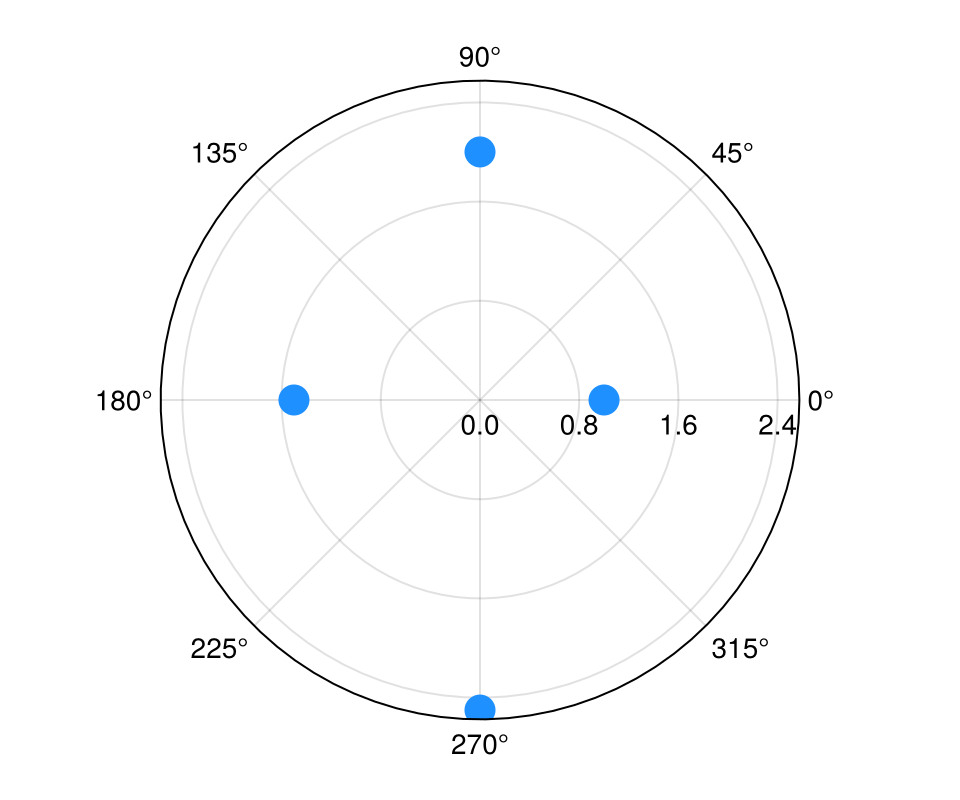
  <span>Polar points</span>
</a>
<a class="masque-gallery-card" data-page="limits">
  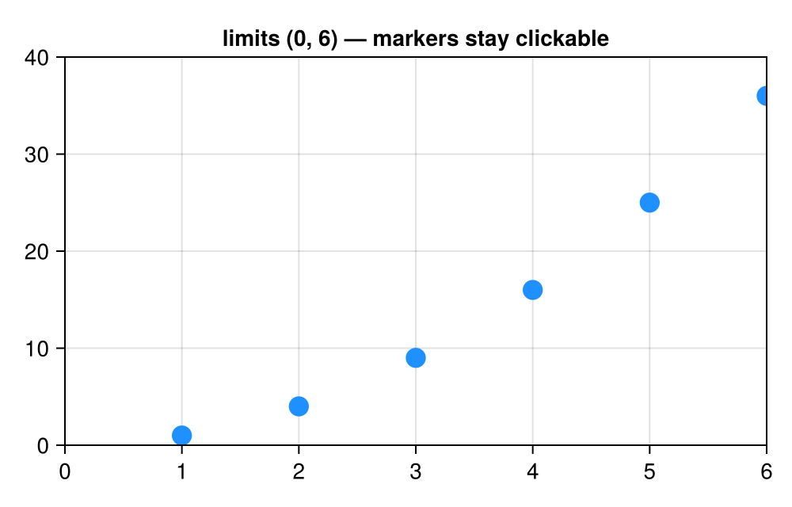
  <span>Limits slider</span>
</a>
<a class="masque-gallery-card" data-page="pan">
  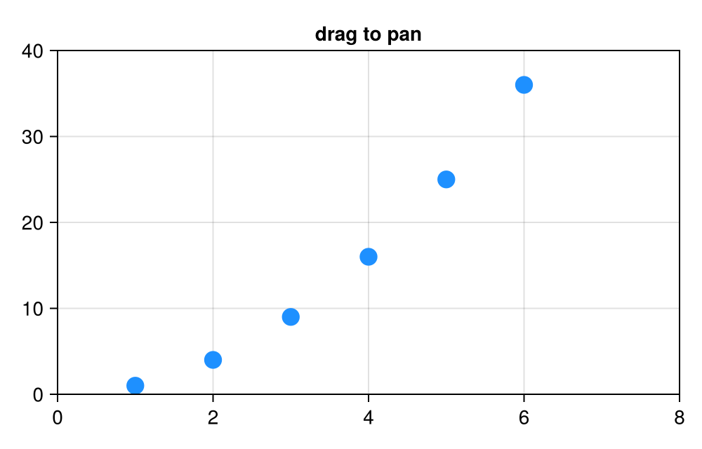
  <span>Drag to pan</span>
</a>
<a class="masque-gallery-card" data-page="orbit">
  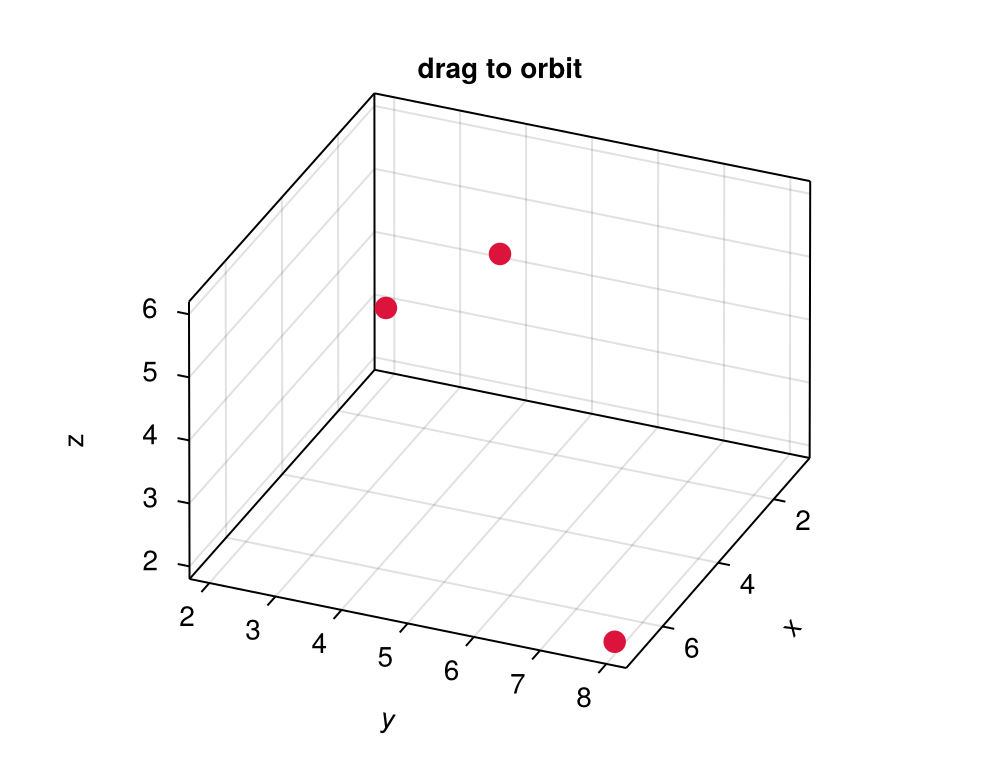
  <span>Drag to orbit</span>
</a>
</div>
<script>
(function () {
  var pretty = /\/$/.test(location.pathname) || /\/index\.html$/.test(location.pathname);
  var root = pretty ? "../" : "";
  document.querySelectorAll("a.masque-gallery-card").forEach(function (a) {
    var page = a.getAttribute("data-page");
    a.href = root + "gallery/" + page + (pretty ? "/" : ".html");
    var img = a.querySelector("img");
    if (img) img.src = root + "assets/gallery/" + page + ".png";
  });
})();
</script>
```
