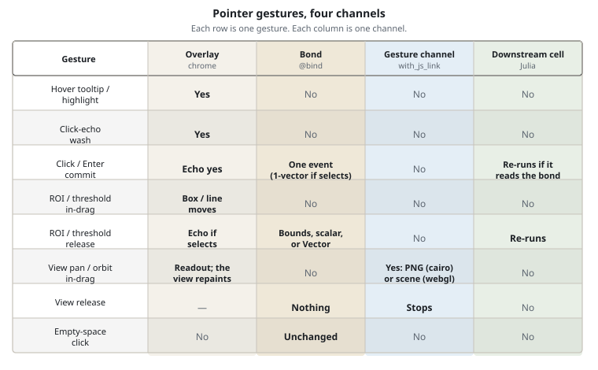
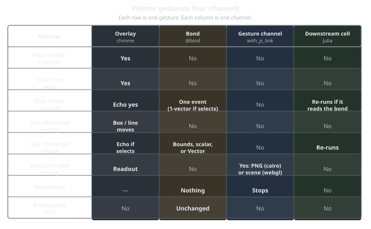

# Overlay, bind, and the host

[Concepts](@ref) explains hover, clicks, and `@bind` for everyday use.
This page is the detailed version: the overlay, `@bind`, the gesture
channel that streams pan frames, and the docs-site player — for when a
hover does not re-run Julia, or a docs embed is not a live notebook.

Masque splits pointer work across four channels: overlay chrome, the `@bind`
bond, the gesture channel, and a downstream Julia cell. Holding the pointer
over a mark is not a click. A click is not a pan.

!!! note

    Hover stays in the overlay. A click writes `@bind`. Pan uses the
    gesture channel and does not write `@bind`. This docs site swaps
    recorded snapshots; it does not run a Julia kernel. A static
    `generate_html` export keeps overlay inspection only.

The three-point scatter on [Getting started](@ref) already shows two of
those channels on one plot. Holding the pointer over a point reads its
name in the overlay. A click writes `sel`. This page names every channel
so a docs-site embed or a static export is not a Masque bug.

## Pluto cells in these docs

Paste each snippet into its own Pluto cell. Pluto runs one top-level
expression per cell. Wrap multiple statements in `begin ... end`. Showing
`fig` alone does not mount the overlay; `masque` returns the HTML that
does. For `Pkg.add(url=…)` and `Pluto.activate_notebook_environment`, see
[Install](@ref).

## One figure, one overlay

At `masque()` time, one Makie `Figure` plus its interactables produces a
backend image (PNG or GPU canvas) and hit geometry for every axis, then one
manifest, then HTML: one image and one overlay. Several axes still share that
overlay. They are not several `masque` calls.

The overlay is a stateless view: tooltips, highlight in the overlay, and
drag chrome. Authoritative analysis state lives in Julia as the `@bind`
bond when a cell reads it.

## Four channels

These four are separate channels, not speeds of one channel.

- **Overlay chrome.** Tooltips, highlight in the overlay, an ROI box, a
  threshold line, and a view readout. No Julia round trip.
- **Bond (`@bind`).** The analysis value a cell reads: a click, an Enter
  commit, an ROI release, or a threshold release.
- **Gesture channel (`with_js_link`).** In-drag pan and orbit frames on
  both backends. Not a bond. Not a faster `@bind`.
- **Downstream Julia cell.** Re-runs only when it reads a bond that changed.

A Dash hover callback is a **click** in Masque. Altair `.interactive()`
pan is overlay motion, not `@bind`. Holding the pointer over a mark
never writes `@bind`.

## Gesture timing

Holding the pointer over a mark never assigns the bond. The highlight after a
click also runs in the overlay. The PNG does not change. An in-drag ROI box
or threshold line stays in the overlay until release. A view drag commits
nothing: camera state is not analysis data.

```@raw html
<div class="masque-diagram">
  
  
</div>
<script>
(function () {
  var wrap = document.currentScript.previousElementSibling;
  if (!wrap || !wrap.classList.contains("masque-diagram")) return;
  var link = document.querySelector('link[href*="masque-embed.css"]');
  var base = "assets/";
  if (link) {
    base = (link.getAttribute("href") || "assets/masque-embed.css")
      .replace(/masque-embed\.css(?:\?.*)?$/, "");
  }
  var imgs = wrap.querySelectorAll("img");
  for (var i = 0; i < imgs.length; i++) {
    var src = imgs[i].getAttribute("src") || "";
    imgs[i].src = base + src.replace(/^.*?assets\//, "");
  }
})();
</script>
```

Each pointer gesture uses a different mix of overlay chrome, the `@bind`
bond, the gesture channel, and a downstream Julia cell.

The following table is the same data, so the figure is not the only
source.

| Gesture | Overlay | Bond | Gesture channel | Downstream cell |
|---|---|---|---|---|
| Hover tooltip / highlight | Yes | No | No | No |
| Click-echo wash | Yes | No | No | No |
| Click / Enter commit | Echo yes | One event (none on a `selects` target layer; the box owns it) | No | Re-runs if it reads the bond |
| ROI / threshold **in-drag** | Box / line moves | No | No | No |
| ROI / threshold **release** | Echo if `selects` | Bounds, scalar, or `Vector` | No | Re-runs |
| View pan / orbit **in-drag** | Readout | No | Yes: new frames | No |
| View **release** | — | **Nothing** | Stops | No |
| Empty-space click | No | Unchanged | No | No |

ROI and threshold in-drag stay in the overlay: it already has what it
needs, so the drag never leaves the browser. In-drag view frames still
leave the overlay: both backends repaint over the gesture channel.
CairoMakie ships a PNG; WGLMakie ships a serialized scene onto the
canvas already on the page. Neither path writes `@bind`. On release the
channel stops, and the bond still holds **nothing** from the pan.

A click in empty space does not write the bond and does not clear a
selection. Enter or Space on a focused mark commits the same way a click
does.

Right-click opens the context menu on the figure: the Cairo image, or
the WebGL canvas. Control-click does the same on macOS. That press does
not start a drag, and the bond stays unchanged.

## Overlay, Julia, and the host

Live Pluto runs every `@bind` row except view. This docs site does not run
those rows live. The quick start on [Getting started](@ref) is a Pluto
export of the tutorial notebook, and every click swaps in a recorded readout.
An overlay-only player keeps tooltip and highlight chrome. Julia stays at
the default bond.

```@raw html
<div class="masque-diagram">
  
  
</div>
<script>
(function () {
  var wrap = document.currentScript.previousElementSibling;
  if (!wrap || !wrap.classList.contains("masque-diagram")) return;
  var link = document.querySelector('link[href*="masque-embed.css"]');
  var base = "assets/";
  if (link) {
    base = (link.getAttribute("href") || "assets/masque-embed.css")
      .replace(/masque-embed\.css(?:\?.*)?$/, "");
  }
  var imgs = wrap.querySelectorAll("img");
  for (var i = 0; i < imgs.length; i++) {
    var src = imgs[i].getAttribute("src") || "";
    imgs[i].src = base + src.replace(/^.*?assets\//, "");
  }
})();
</script>
```

The same gesture can run in the overlay, write `@bind`, swap a recorded
snapshot, or stay frozen, depending on the host.

The following table is that split.

| Gesture | Live Pluto | Docs player (every click and brush recorded) | Docs player (overlay-only) | Static `generate_html` |
|---|---|---|---|---|
| Hover | Overlay tooltip and highlight | Overlay tooltip and highlight | Overlay tooltip and highlight | Overlay tooltip and highlight |
| Click-echo | Highlight in the overlay | Highlight in the overlay | Highlight in the overlay | Highlight in the overlay |
| Element click `@bind` (incl. extra table cells) | Bond writes; every cell that reads it re-runs | Snapshot swap for every cell in the embed | Overlay chrome; Julia stays at the default bond | Overlay chrome; `@bind` dead |
| ROI brush (`selects`) / a few axis or threshold values | Bond writes on release | Snapshot swap for every box, or for each listed value | Overlay chrome; Julia stays at the default bond | Overlay chrome; `@bind` dead |
| Unlisted continuous drag | Overlay chrome during the drag; Julia on ROI or threshold release; view never writes `@bind` | An axis or threshold value that is not listed: Julia stays on the last listed set (a `selects` box has no unlisted drag, since every box is recorded) | Overlay chrome; Julia stays at the default bond | Overlay chrome; `@bind` dead |
| Heatmap inspect | Overlay tooltip; Julia on click | Overlay tooltip; every cell click swaps the readout | Overlay tooltip chrome if that player is present | Overlay tooltip; Julia click dead |
| Cairo view frames (GIF/MP4, no `@bind`) | Gesture channel frames; no `@bind` | GIF/MP4 on this site; no `@bind` | Overlay readout; no frames; no `@bind` | Gesture channel dead; site uses GIF/MP4 |

The docs build records every element, legend, and grid-cell click a
player's figure offers, and every box a `selects` brush can draw, so
those clicks and releases swap the readout. An axis or
colorbar click, and a click on a grid that a box brushes, has no recorded
snapshot. View pan never appears as an
`InteractionEvent`. For a box that filters a table, see
[Brush a region](@ref). For that heatmap, see
[Inspect a grid](@ref). For pan and orbit, see [Pan and orbit](@ref).

## Common mistakes

- Do not write a cell that reads `pick` expecting it to update when you hold
  the pointer over a mark. That path is overlay-only.
- Do not treat a docs player as live Pluto. Axis, ROI, and threshold commits
  write `@bind` in a notebook. On this site, a listed player snapshots those
  commits, and view has no `@bind`.
- Do not design a click demo around more marks than a player can record.
  The docs build records every element, legend, and grid-cell click and
  fails a player over its size budget; use a coarser grid or fewer marks.
- Do not expect SliderServer or `Bonds.possible_values` to enumerate Masque
  bonds.
