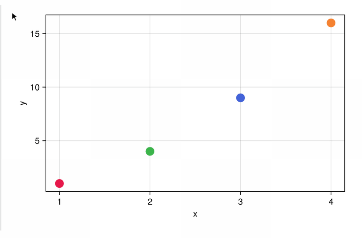
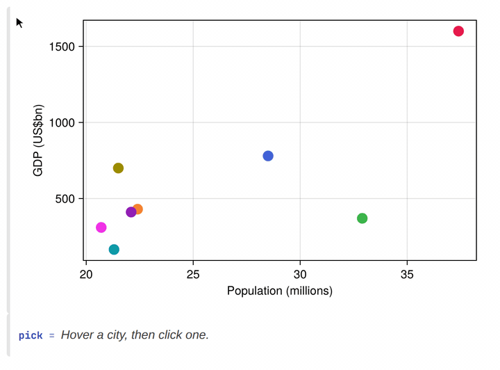
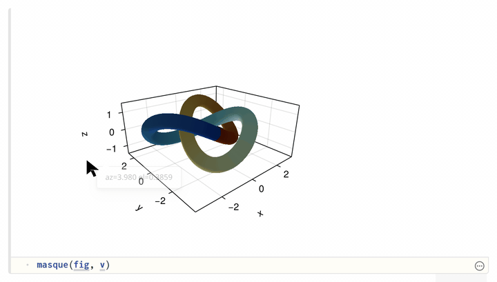
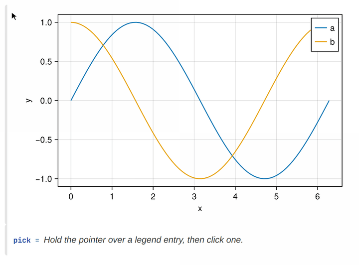

# Masque.jl

Masque adds an interactive layer over Makie figures inside a Pluto
notebook. Add rich tooltips, hover interactions, selections, and more to
your figures.

## Rich tooltips



Hold your pointer over a point, bar, heatmap cell, polygon, or legend entry and a customizable tooltip appears on the figure. For templates and styling, see [Tooltips](@ref).

## Dynamic selections



When you click a mark to select it, `@bind` captures that selection, the same way a PlutoUI slider does. Downstream cells re-run with the selected row, bar, or cell. For more information, see [Click marks](@ref) and [Selection](@ref).

## Interactive view controls



Drag a 2D axis to pan, or an `Axis3` to orbit. The camera stays on the figure; it is not a selection. For more information, see [Pan and orbit](@ref).

## Highlight from the legend



Click a legend entry to highlight the traces it labels, and a cell that reads that pick can fade the rest. See [Legend](@ref).

## Inspect a static export

Hover and click still work in a Pluto HTML export of the notebook.
Re-running Julia cells needs a live session. CairoMakie is the default;
WGLMakie is the live canvas when you want animation, large data, or 3D
you can orbit. See [Backends](@ref).

```@raw html
<div class="masque-embed-wrap">
<iframe id="masque-home-export" title="New York City boroughs with overlay-only hover"
        style="width:100%;height:520px;border:0;background:transparent;overflow:hidden;"
        scrolling="no" loading="lazy"></iframe>
</div>
<script>
(function () {
  var el = document.getElementById("masque-home-export");
  if (!el) return;
  function isDocDark() {
    var c = document.documentElement.className || "";
    if (!c) return false;
    if (/(^|\s)theme--(documenter-light|catppuccin-latte)(\s|$)/.test(c)) return false;
    return /(^|\s)theme--/.test(c);
  }
  function pushTheme() {
    var doc = el.contentDocument;
    if (!doc) return;
    doc.documentElement.classList.toggle("pluto-dark", isDocDark());
  }
  el.addEventListener("load", pushTheme);
  new MutationObserver(pushTheme).observe(document.documentElement, { attributes: true, attributeFilter: ["class"] });
  el.src = "embeds/home_export.html";
})();
</script>
```

## Where to go next

- [Getting started](@ref) — install, overlay a figure, and read a click
- [Constructors](@ref) — every built-in kind, its constructor, and its
  default payload
- [Selection](@ref) — reacting to clicks, linking plots, persisting a
  highlight
- [Legend](@ref) — hover/click a `Makie.Legend` entry to highlight the
  trace(s) it labels
- [Tooltips](@ref) — `masque"..."` templates and styling
- [Custom hits](@ref) — `RegionInteractable` / `FunctionInteractable`
- [Backends](@ref) — `:cairo` vs `:webgl`, and when to reach for which
- [Troubleshooting](@ref) — common errors and what causes them
- [Examples](@ref) — every runnable notebook in the repo
- [API](@ref) — full docstrings

