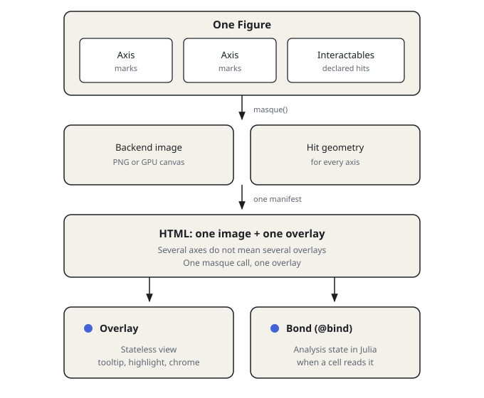
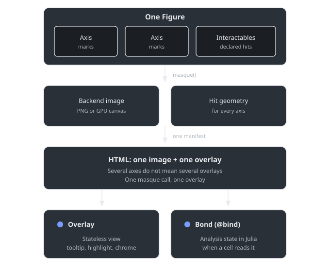

# Masque.jl

In Pluto, turn a Makie figure into something you can hover, click, and
bind into other cells — without redrawing the plot in JavaScript
yourself.

Masque overlays a Makie figure with a client-side interactive layer.
CairoMakie renders a static image; Masque hit-tests on top. WGLMakie
(experimental) renders a live GPU canvas instead. The `masque` / `@bind`
API is the same on both. Load one backend before you call `masque`. If
both are loaded, an unqualified `masque` uses CairoMakie.

## When to use it

The following table compares Masque to using a Makie backend with no overlay.

| Feature | CairoMakie alone | WGLMakie alone | Masque |
|---|---|---|---|
| Output | Static, publication-quality | Live, GPU-rendered | Static image plus overlay (`:cairo`), or live canvas (`:webgl`) |
| Interactivity | None | Rich (pan, zoom, rotate) | Tooltips, click to select, drag to pan, threshold, or ROI |
| Needs a live Julia process | No | Yes | `@bind` recomputes and CairoMakie pan frames, yes; tooltips and the click highlight, no |
| Survives offline / static HTML export | Yes | No | Yes on both backends for inspection; `@bind` recomputes need a kernel |

The overlay HTML is Pluto notebook MIME. VS Code's plot pane, the Julia
REPL, and a Documenter `@example` block do not run `@bind`. GLMakie is
not a Masque backend; load CairoMakie or WGLMakie.

Masque is not in the General registry. For clone, `Pkg.develop`, and
`Pkg.add(url=…)` cells, see [Install](@ref).

```@raw html
<div class="masque-diagram">
  
  
</div>
<script>
(function () {
  var wrap = document.currentScript.previousElementSibling;
  if (!wrap || !wrap.classList.contains("masque-diagram")) return;
  var link = document.querySelector('link[href*="masque-embed.css"]');
  var base = "assets/";
  if (link) {
    base = (link.getAttribute("href") || "assets/masque-embed.css")
      .replace(/masque-embed\.css(?:\?.*)?$/, "");
  }
  var imgs = wrap.querySelectorAll("img");
  for (var i = 0; i < imgs.length; i++) {
    var src = imgs[i].getAttribute("src") || "";
    imgs[i].src = base + src.replace(/^.*?assets\//, "");
  }
})();
</script>
```

One `masque` call produces one image and one overlay from a Makie
`Figure` and its interactables. The overlay is a view. The `@bind` bond
is Julia state when a cell reads it.

## Where to go next

- [Getting started](@ref) — overlay, hover, click, and a readout.
- [Hover, click, and bind](@ref) — overlay versus `@bind` versus the
  docs player.
- [Examples](@ref) — kitchen-sink notebooks and static exports.
