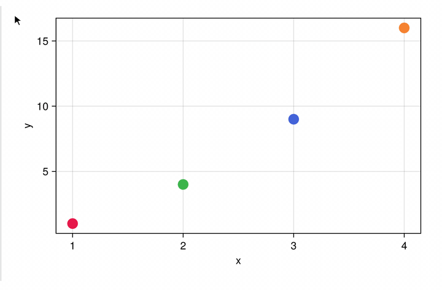
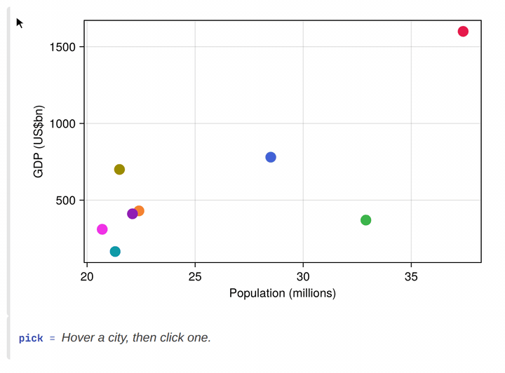
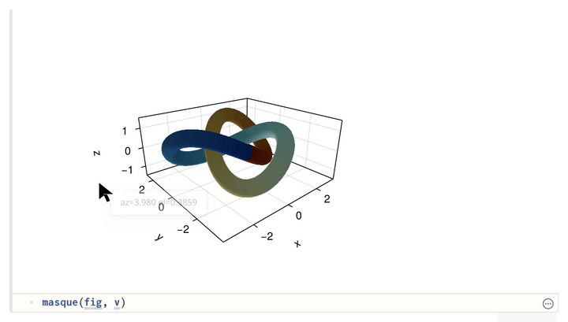
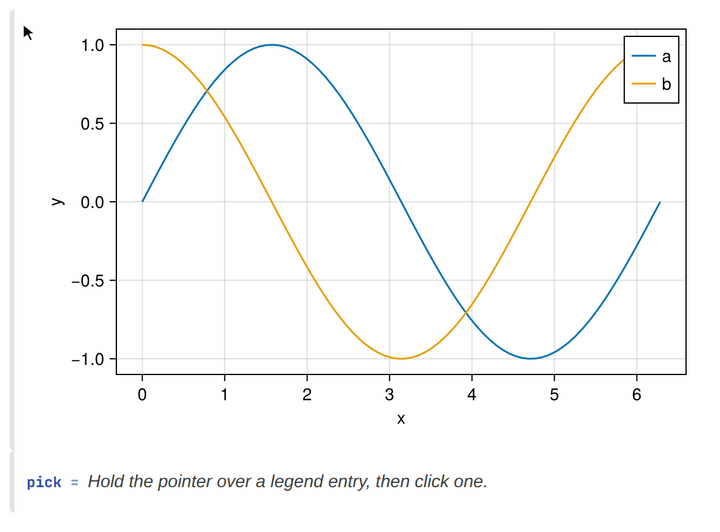

# Masque.jl

Masque adds tooltips and click selection to Makie figures in a Pluto
notebook. Clicking a mark updates a `@bind` variable, so the rest of your
notebook can respond. [Ready to get started?](getting-started.md)

## [Tooltips](@id home-tooltips)



Hover over a point, bar, heatmap cell, or polygon to see its data in a
tooltip. You choose what the tooltip says. See [Tooltips](@ref).

## Select marks



Click a mark to send it to your notebook. See [Click marks](@ref) and
[Selection](@ref).

## [Pan and orbit](@id home-pan-orbit)



Drag a 2D axis to pan, or an `Axis3` to orbit, and scroll to zoom
either. See [Pan and orbit](@ref).

## Highlight from the legend



Click a legend entry to highlight the traces it labels, and a cell that
uses the selection can fade the others, as in this example. See
[Legend](@ref).

## Static exports

Tooltips and highlights keep working in a static HTML export of your
notebook, like the figure below: hover over a borough to try it. See
[Static exports and this site](@ref).

```@raw html
<div class="masque-embed-wrap">
<iframe id="masque-home-export" data-masque-embed="home_export" title="New York City boroughs. Hover a borough to see its name." style="width:100%;height:520px;border:0;background:transparent;overflow:hidden;" scrolling="no" loading="lazy"></iframe>
</div>
```

## [Backends](@id home-backends)

Masque works with CairoMakie and WGLMakie. See [Backends](@ref) to
choose between them.

## Where to go next

- [Getting started](@ref): install Masque and make a figure interactive
- [Concepts](@ref): how hover, clicks, payloads, and `@bind` fit together
- [Constructors](@ref): every interactable, its constructor, and its
  default fields
- [Selection](@ref): react to clicks, link plots, and keep a highlight
- [Legend](@ref): highlight the traces a legend entry labels
- [Tooltips](@ref): templates and styling
- [Custom hits](@ref): `RegionInteractable` and `FunctionInteractable`
- [Backends](@ref): CairoMakie or WGLMakie, and when to use each
- [Troubleshooting](@ref): common errors and their causes
- [Examples](@ref): worked examples, one page per plot type
- [API](@ref): full docstrings
