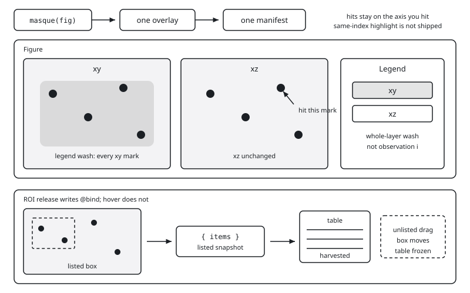
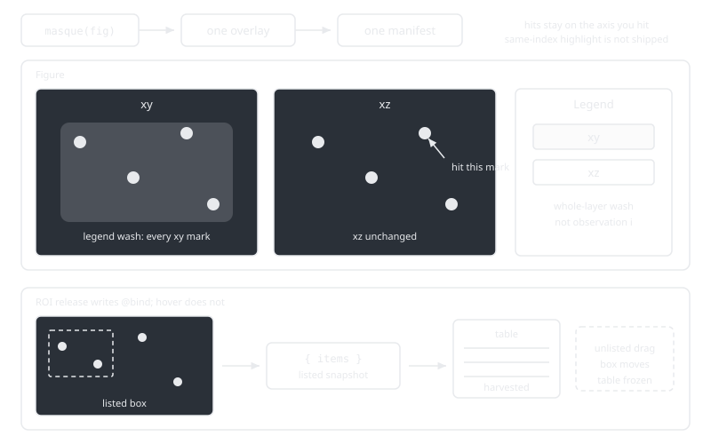

# Linked views

Put two axes in one figure. One `masque` call covers both: you get one
overlay, and layers from every `Axis`, `Axis3`, and `PolarAxis` share
the hit list. Hold your pointer over a mark, or click it, and the
overlay responds on the axis you hit. For the first overlay, see
[Getting started](@ref).

```@raw html
<div class="masque-diagram">
  
  
</div>
<script>
(function () {
  var wrap = document.currentScript.previousElementSibling;
  if (!wrap || !wrap.classList.contains("masque-diagram")) return;
  var link = document.querySelector('link[href*="masque-embed.css"]');
  var base = "assets/";
  if (link) {
    base = (link.getAttribute("href") || "assets/masque-embed.css")
      .replace(/masque-embed\.css(?:\?.*)?$/, "");
  }
  var imgs = wrap.querySelectorAll("img");
  for (var i = 0; i < imgs.length; i++) {
    var src = imgs[i].getAttribute("src") || "";
    imgs[i].src = base + src.replace(/^.*?assets\//, "");
  }
})();
</script>
```

One `masque` call covers every axis: independent hits, legend whole-layer
wash, and a listed ROI item set that updates a harvested table.
Same-index highlight between two scatters is not shipped.

`auto_interactables` walks every axis it knows, plus every `Colorbar` and
`Legend`. It does not install `AxisInteractable`, `ThresholdInteractable`,
`ROIInteractable`, `ViewInteractable`, or `SliceInteractable`. Append
those yourself. Layer ids
must not collide; a second scatter becomes `:scatter_2`.

## Inspect two views of the same points

Four points, `xs`, `ys`, `zs`, two `Axis` panels. Zero-config
`masque(fig)` overlays both scatters. Hold the pointer over a mark in
either panel: the tooltip and highlight in the overlay stay on that
panel. The other scatter does not highlight.

Do not use `Axis3` for this job. Two 2D axes are the 2D-of-3D shape.

```@raw html
<div class="masque-embed-wrap">
<iframe id="masque-lv-two-axis" data-masque-embed="linked_two_axis" title="Two Axis panels, four points, overlay-only hover" style="width:100%;height:1100px;border:0;background:transparent;overflow:hidden;" scrolling="no" loading="lazy"></iframe>
</div>
```

```@eval
Main.masque_fallback("linked_two_axis")
```

The notebook is that figure. A click writes one [`ElementEvent`](@ref): `layer` is `:scatter` or
`:scatter_2`, and `index` is 1-based in that layer. Same row order in
both scatters is an authoring coincidence. Masque does not treat those
indexes as one observation.

Optional: put `(; i, x, y, z)` on both [`PointInteractable`](@ref)s so
the tooltip on either view can show the third coordinate. That tooltip
still runs in the overlay. It still does not wash the other axis.

Do not add a second `@bind pick` cell. Do not `deepcopy(fig)`.

## Highlight a series across axes

A legend entry highlights the traces it names, including layers on
other axes. A spec is a layer id — every element of that layer — or
`id:k` pinning element `k`. That wash is client-side: it does not
write `@bind`. It is the only shipped cross-layer highlight. It is
series-shaped, not observation `i`. Hold the pointer over **xy** and
every mark of that series highlights in the overlay. Point 3 in both
panels does not.

Two lines on one axis stay on [Legend](@ref). The two-panel wash lives
here.

```@raw html
<div class="masque-embed-wrap">
<iframe id="masque-lv-legend-wash" data-masque-embed="linked_legend_wash" title="Legend whole-layer wash across two Axis panels" style="width:100%;height:1100px;border:0;background:transparent;overflow:hidden;" scrolling="no" loading="lazy"></iframe>
</div>
```

```@eval
Main.masque_fallback("linked_legend_wash")
```

The notebook is that figure. `masque(fig)` picks up the `Legend`. Click still reports the legend
entry (`layer === :legend`), not each washed mark. The overlay cannot
hide Makie traces. Use the wash plus `@bind` so a Julia cell can
filter the series. For `targets=` and a click readout, see
[Legend](@ref).

## Same-index highlight is not shipped

Hold the pointer over, or click, index `i` of `:scatter`. Index `i` of
`:scatter_2` does not highlight in the overlay. There is no JavaScript
join on a payload field.

Do not emit a custom [`HitLayer`](@ref) as a join on observation `i`.
Naming other layers still washes every element of those layers.

## Filter a table from a region

Drag the box; the overlay moves it. On release the bond is a
`Vector{ElementEvent}` (empty `[]`, never `nothing`). A downstream
cell slices the table. Before the first release the bond is `nothing`
unless you pass `selected=`.

That job is the listed `{ items }` player on [Brush a region](@ref):
constructor, idle plus empty plus enclosed-point sets, and the harvested
table cell. Unlisted drags keep the box moving; the table stays on the
last listed set. One ROI, one `:circles` or `:grid` target, rectangle
only. `masque(fig)` does not add the box.

Do not snapshot pixel bounds. Do not expect a second axis's marks to
fall in this box (viewports do not overlap).

## Drive a second plot from a click

`layer` and `index` are plain data. One click can drive any
number of downstream cells: filter a table, remount a second figure, or
recompute a fit. Give the `payloads` on two interactables the same shape
and key on it, with no extra Masque API:

```julia
rows = pick === nothing ? data : filter(r -> r.id == pick.id, data)
```

To wash the same index list on remount, pass `selected=` on both layer
ids. That is a Julia rebuild, not live hover:

```julia
masque(
    fig, ints;
    selected = Dict(:scatter => [i], :scatter_2 => [i]),
)
```

Last pick wins. A later click is an [`ElementEvent`](@ref) and
replaces a hydrated vector wholesale. Two `masque` widgets do not share
overlay state: each has its own overlay. [Selection round-trip](@ref)
passes one widget's `@bind` into `selected=` on a second widget. To
accumulate across clicks, keep a `Ref` in a cell that does not read the
bond, as that page describes.

A second plot that filters on a pick is a **click**, not a pointer hold.
Holding the pointer over a mark does not write `@bind` and does not
rebuild Julia. For `selected=` kinds and persist, see [Selection](@ref).

## What is not shipped

- No shared `ColumnDataSource`.
- No same-index highlight between two scatters.
- No automatic echo onto a second axis.
- No lasso.
- No SPLOM or crossfilter of several brushes (one ROI, one target).

For overlay versus `@bind` timing, see [Overlay, bind, and the host](@ref).
For the demos, see [Gallery](@ref).
